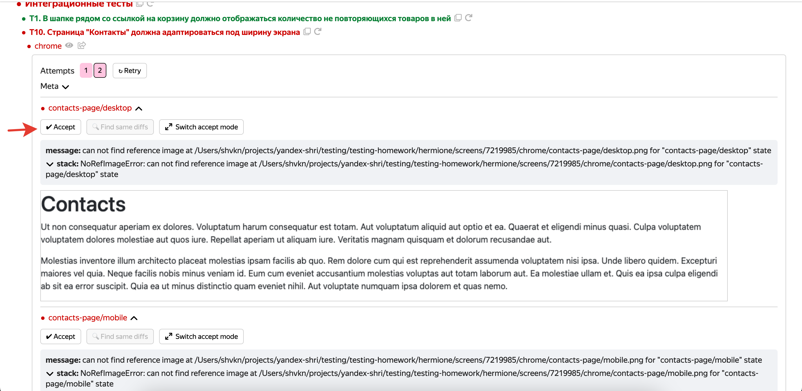

# Домашнее задание: Автотесты

если появятся вопросы TG: @shvkn1 
## Как запустить

```sh
# установить версию node 16.20.1
nvm use 16.20.1

# установите зависимости
npm ci

# соберите клиентский код приложения
npm run build

# Сделайте первый прогон без бага
npm run start
npm run test:e2e:gui
```

### Важно! На первом прогоне без бага необходимо принять все референсы скринов



### Выполните 10 прогонов с BUG_ID

```
BUG_ID=1 npm run start
```
```
BUG_ID=2 npm run start
```
```
BUG_ID=3 npm run start
```
```
BUG_ID=4 npm run start
```
```
BUG_ID=5 npm run start
```
```
BUG_ID=6 npm run start
```
```
BUG_ID=7 npm run start
```
```
BUG_ID=8 npm run start
```
```
BUG_ID=9 npm run start
```
```
BUG_ID=10 npm run start
```
